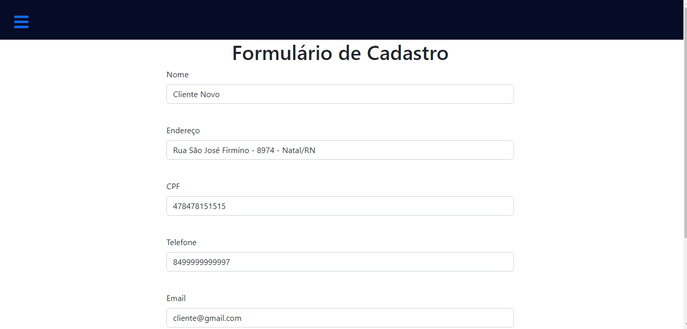
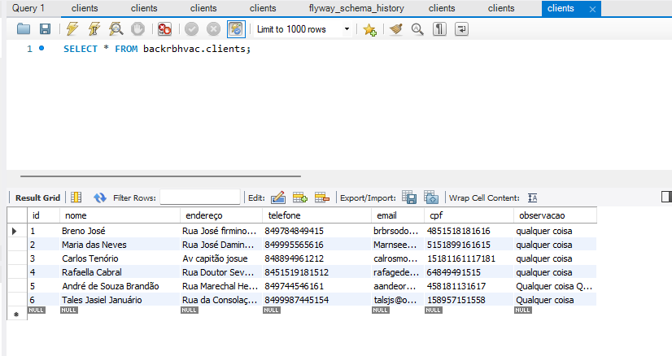

# Front-end - Sistema de Gestão RBHVAC 

O Projeto tem por objetivo elaborar o sistema de gestão para empresa de Refrigeração

Este projeto é composto por duas partes(Back-end e Front-end).  

## Front-end

Projeto em desenvolvimento utilizando:

- Ambiente desenvolvido em React Js, utilizando componentização, Hooks, React Router
- Axios para a realização de requisições ao servidor 
- Html, Css, Javascript, Bootstrap

<h3> 💻💻 Projeto em desenvolvimento 💻💻... </h3>

## Features implementadas

- CRUD responsável pela criação e edição de clientes conectado ao Bando de Dados
- Sidebar de navegação

## Back-end

Projeto em desenvolvimento utilizando:

- Java e Spring Boot

## Features implementadas

- ApiRest responsável pela implementação do CRUD de cadastros de clientes
- Utilização de padrão MVC, Migrations, VO/DTO.
- Banco de dados MySQL 

Acesso ao repositório [Back-end](https://github.com/RamonBatalha/backrbhvac) 

## Instruções para teste

- Realizar o clone do Back-end e Front-end e rodar em cojunto
- o Projeto está configurado para rodar no localhost em conjunto com BD MySQL